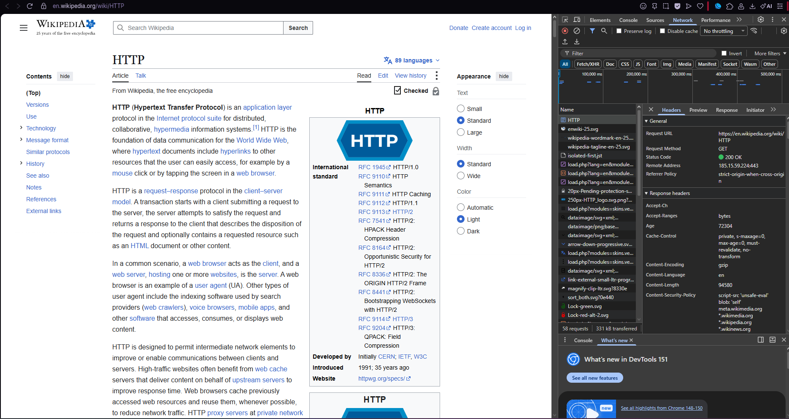
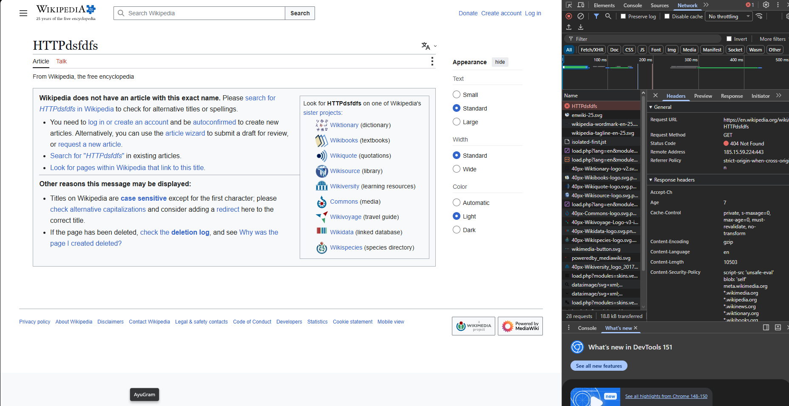
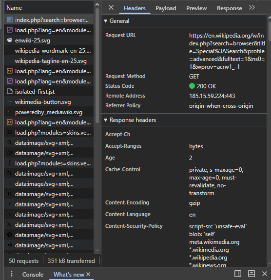
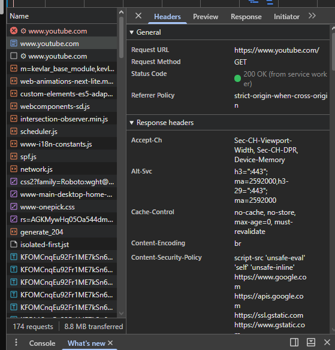

Брагарь Всеволод I-**2502**

Задание 1:
**URL**: [https://en.wikipedia.org/wiki/**HTTP**](https://en.wikipedia.org/wiki/**HTTP**)
Method: **GET** - Браузер запрашивает данные с сервера и не должен изменять состояние ресурса
Status: **200** OK - Сервер успешно обработал запрос и вернул запрошенный ресурс
Заголовки запроса:
1. Content-Type - text/html; charset=**UTF**-8
2. Date - Wed, 09 Sep **2026** 14:43:29 **GMT**
3. Last-Modified - Wed, 09 Sep **2026** 14:12:33 **GMT**
4. Age - **72304**
5. Accept-Ranges - bytes
6. User-Agent - Mozilla/5.0 (Windows NT 10.0; Win64; x64) AppleWebKit/**537**.36 (**KHTML**, like Gecko) Chrome/**151**.0.0.0 Safari/**537**.36 **OPR**/**135**.0.0.0
и.т.д

Тела запрос в **GET** нет Так же были отправлены **CSS**, JavaScript запросы для получения стилей, скриптов, картинок и всех остальных файлов, которые отображаются на страничке

При переходе на страничку с неправильным адресом произошла ошибка **404** Not Found 

Задание 2: **URL**: [https://en.wikipedia.org/w/index.php?search=browser&title=Special%3ASearch&profile=advanced&fulltext=1&ns0=1&wprov=acrw1_-1](https://en.wikipedia.org/w/index.php?search=browser&title=Special%3ASearch&profile=advanced&fulltext=1&ns0=1&wprov=acrw1_-1) Method: **GET** - Пользователь передаёт серверу параметры, необходимые для формирования результата, а сервер возвращает найденную информацию Параметры: ?search=browser&title=Special%3ASearch&profile=advanced&fulltext=1&ns0=1 поиск = слово браузер на страничке спешл серч в эввэндсей поиске полное слово только названия страничек 

Задание 3:
YouTube
1. **URL**: [https://[www.youtube.com/](https://www.youtube.com/](https://www.youtube.com/](https://www.youtube.com/))
2. Method: **GET**
3. Status: **200** OK
4. User-Agent - Mozilla/5.0 (Windows NT 10.0; Win64; x64) AppleWebKit/**537**.36 (**KHTML**, like Gecko) Chrome/**151**.0.0.0 Safari/**537**.36 **OPR**/**135**.0.0.0
5. Referer - 
[https://elearning.usm.md/](https://elearning.usm.md/)
6. Content-Type - 
text/html; charset=utf-8

Задание 4: 
1. **GET** / **HTTP**/1.1 Host: sandbox.usm.com User-Agent: Bragari Vsevolod
2. **POST** /cars **HTTP**/1.1 
Host: sandbox.usm.com 
Content-Type: application/json 
User-Agent: Seva Bragar 
{ 
*make*: *Toyota*, 
*model*: *Corolla*, 
*year*: **2020** 
}

Кроме **GET**, **POST**, **PUT** и **DELETE** существуют, например:

**PATCH** — частичное изменение ресурса. **HEAD** — получение заголовков ответа без тела. **OPTIONS** — получение информации о поддерживаемых сервером методах. **CONNECT** — установка туннеля с сервером, например для **HTTPS** через прокси. **TRACE** — диагностический метод для проверки обработки запроса.

3. **PUT** /cars/1 **HTTP**/1.1 
Host: sandbox.usm.com 
User-Agent: Bragari Vsevolod
Content-Type: application/json 
{ 
    *make*: *Toyota*, 
    *model*: *Corolla*, 
    *year*: **2021** 
}
**PUT** обычно используется для полной замены ресурса.

**PATCH** используется для частичного изменения ресурса.

4. **HTTP**/1.1 **201** Created 
Content-Type: application/json 
{ 
    *id*: 1, 
    *make*: *Toyota*, 
    *model*: *Corolla*, 
    *year*: **2020** 
}

**200** OK Сервер успешно обработал запрос. Например, автомобиль был успешно добавлен, а **API** использует **200** вместо **201**.

**201** Created Новый ресурс был успешно создан. Например, после **POST** /cars сервер создал новый автомобиль.

**400** Bad Request
Запрос содержит ошибку.
Например, отсутствует обязательное поле:
{
    *make*: *Toyota*
}
а сервер требует также model и year.

**401** Unauthorized Для выполнения запроса требуется аутентификация, но пользователь не авторизован или не предоставил правильные данные авторизации.

**403** Forbidden Сервер понял запрос, но запрещает пользователю выполнять данное действие. Например, пользователь авторизован, но не имеет прав создавать автомобили.

**404** Not Found Запрошенный ресурс не существует. Например, был указан неправильный **URL**

**500** Internal Server Error На сервере произошла внутренняя ошибка, из-за которой он не смог обработать запрос.