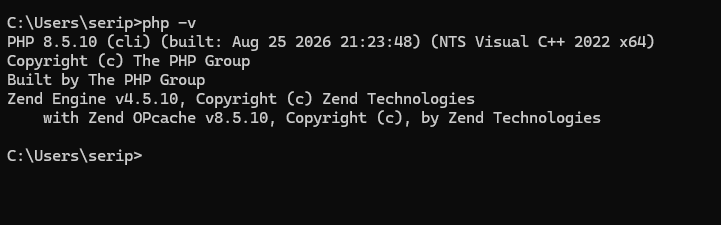
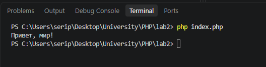
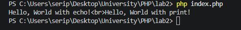
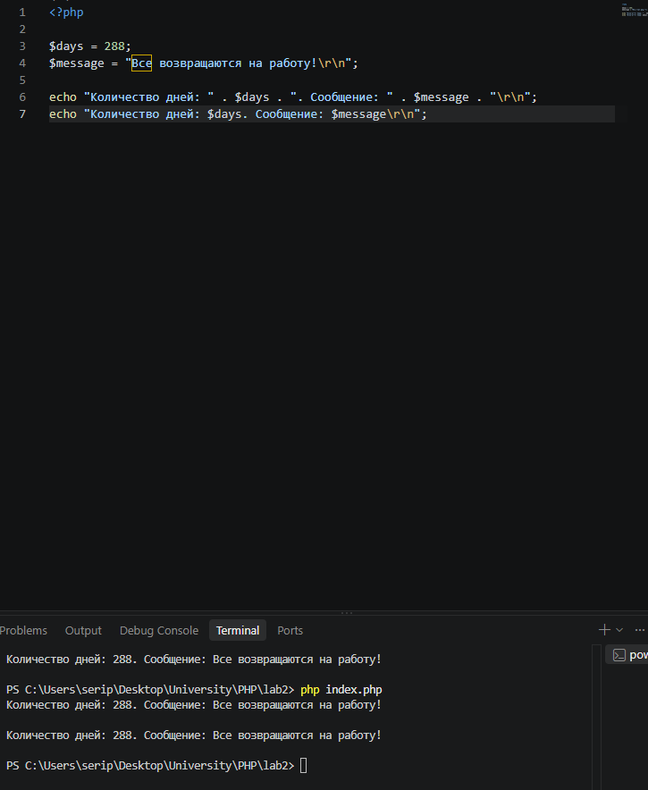

## Установка PHP

## Написание первой PHP-программы

## Вывод данных в PHP

## Работа с переменными и выводом

## Контрольные вопросы

### 1. Какие способы установки PHP существуют?

PHP можно установить несколькими способами:

- Скачать PHP с официального сайта и установить вручную.
- Установить готовый локальный серверный пакет, например XAMPP, OpenServer или Denwer.

### 2. Как проверить, что PHP установлен и работает?

В командной строке нужно выполнить команду:

php -v

### 3. Чем отличается оператор `echo` от `print`?

`echo` и `print` используются для вывода данных на экран.

- `echo` может выводить несколько значений и не возвращает результат.
- `print` выводит только одно значение и возвращает `1`, поэтому его можно использовать в выражениях.
- `echo` обычно немного быстрее, но в большинстве простых случаев разница незаметна.

